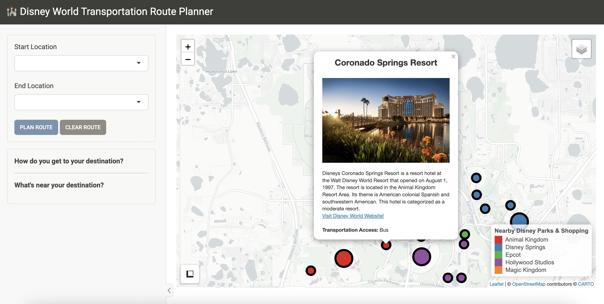
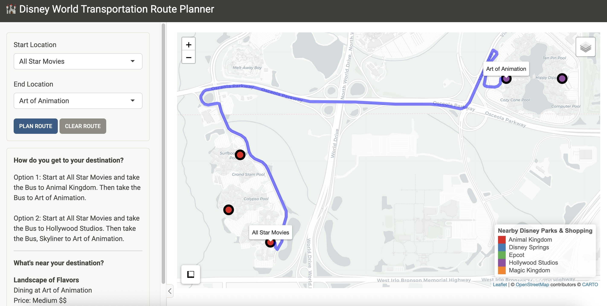

# 🏰 Disney Transportation Route Planner

A Shiny app to help guests explore and plan transportation routes across Walt Disney World Resorts, Parks, and nearby destinations. Whether you're navigating between resorts, planning your park-hopping day, or simply curious about what's nearby — this tool helps you plan smarter and travel easier.

---

## ✨ Features

- 🗺️ **Interactive Map**: Visualize resorts, parks, shopping areas, and restaurants with color-coded markers.
- 🧭 **Route Planner**: Select a start and end location to:
  - Generate a suggested travel route via Disney transportation (bus, monorail, Skyliner, etc.).
  - Display walking options where available.
  - Visualize the route on the map with start/end labels.
- 🍽️ **Nearby Attractions**: When you choose a destination, view dining, entertainment, and shopping options available at or near your arrival point.
- 📏 **Distance & Duration**: View estimated route distance and travel time using real routing data via OSRM.
- 🧼 **Reset & Explore**: Use “Clear Route” to reset inputs and explore the map again.

---

## 🔧 How It Works

1. **Choose your start and end location** from the dropdown menus in the sidebar.
2. Click **"Plan Route"** to generate a recommended route using available Disney transportation.
3. The **map updates** with your route and zooms to fit.
4. View a text-based explanation of the route and transportation methods.
5. Scroll down to see **restaurants and nearby places** at your destination.

---

## 🖼️ Screenshots

**Home View:**



**Planned Route Example:**



---

## 📦 Data Sources

The app is built using a custom dataset that includes:
- Location data for all major Disney Resorts, Parks, Dining, and Transportation Hubs.
- Transportation access modes (Bus, Monorail, Skyliner, Boat, Walk).
- Blurbs, descriptions, and pricing levels for dining and attractions.

---

## 💡 Future Ideas

- Filter destinations by class (Dining, Resort, Park).
- Add search for attractions by name.
- Optimize transportation route based on current park hours or closures.

---

## 🚀 Getting Started (Locally)

To run the app locally in R:

```r
# Install required packages
install.packages(c("shiny", "leaflet", "dplyr", "osrm", "sf", "bslib", "shinyjs"))

# Launch the app
shiny::runApp("path_to_your_app_folder")
```

